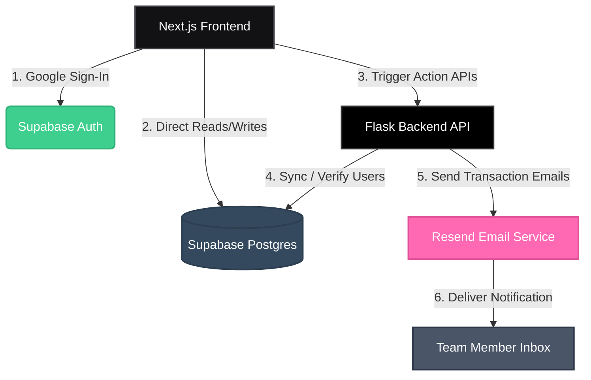
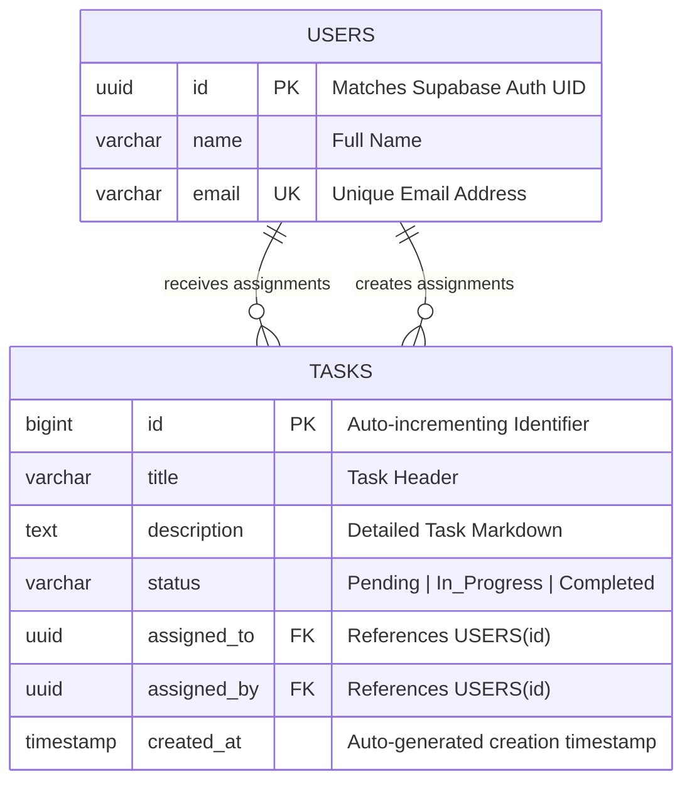

# 🌟 HairDrama Task Manager
[](https://nextjs.org/)
[](https://www.typescriptlang.org/)
[](https://tailwindcss.com/)
[](https://supabase.com/)
[](https://flask.palletsprojects.com/)
[](https://resend.com/)
[](https://vercel.com/)
[](https://render.com/)
---
## 📖 Table of Contents
* [🚀 Project Overview](#-project-overview)
* [✨ Core Features](#-core-features)
* [🏗️ Architecture](#️-architecture)
* [💻 Tech Stack](#-tech-stack)
* [🗄️ Database Schema](#️-database-schema)
* [📁 Folder Structure](#-folder-structure)
* [🛠️ Installation & Local Setup](#️-installation--local-setup)
  * [Backend (Flask) Setup](#backend-flask-setup)
  * [Frontend (Next.js) Setup](#frontend-nextjs-setup)
* [🔑 Environment Variables](#-environment-variables)
* [🔌 API Endpoints](#-api-endpoints)
* [🚀 Deployment Guide](#-deployment-guide)
* [📸 Screenshots](#-screenshots)
* [🔮 Future Enhancements](#-future-enhancements)
* [🎓 Learning Outcomes](#-learning-outcomes)
* [🤝 Contributing](#-contributing)
* [📄 License](#-license)
* [✍️ Author](#️-author)
---
## 🚀 Project Overview
**HairDrama Task Manager** is a premium, production-grade full-stack task management platform built for modern, high-velocity teams. In collaborative work environments, tracking responsibilities can become chaotic—or, as we call it, a "drama." This application eliminates the friction by providing teams with a streamlined, central workspace to create, assign, track, and complete tasks with automated notifications.
Leveraging **Next.js 15** with React Server Components, a secure **Supabase** backend for authentication and database management, a lightweight **Flask** API microservice for notifications, and **Resend** for transaction email alerts, HairDrama ensures that no task falls through the cracks.
---
## ✨ Core Features
*   **🔒 Google OAuth Authentication:** Passwordless, secure login facilitated through Supabase Auth.
*   **👥 User & Team Directory:** Automatic sync of authenticated users into a central directory for quick task assignment.
*   **➕ Task Creation & Editing:** Intuitive, modal-driven task creation with markdown description support.
*   **🎯 Intelligent Assignment:** Assign tasks to any team member with automatically tracked "Assigned By" and "Assigned To" metadata.
*   **📊 Task Status Tracking:** Real-time state management representing three core lifecycle stages: `Pending`, `In Progress`, and `Completed`.
*   **📧 Automated Email Notifications:** 
    *   **On Assignment:** The assignee receives an immediate email with task details, description, and a link to their dashboard.
    *   **On Completion:** The assigner receives a confirmation email once the task is marked completed.
*   **📱 Responsive SaaS Dashboard:** Premium, glassmorphic dark-themed layout optimized for desktop, tablet, and mobile screens.
---
## 🏗️ Architecture
The application relies on a decoupled, microservices-oriented architecture:

### Architectural Flow:
1.  **Authentication:** The frontend initializes Google OAuth via Supabase client libraries.
2.  **Database Actions:** Standard task mutations (creation, updates, deletes) are performed directly through Supabase client queries or backend API wrappers.
3.  **Flask Microservice:** When specific mutations require complex side-effects (such as sending transactional emails), the frontend hits custom endpoints on the Flask backend.
4.  **Resend Email Service:** The Flask server processes templates and makes calls to the Resend API to deliver responsive notification emails.
---
## 💻 Tech Stack
|
 Component 
|
 Technology 
|
 Purpose 
|
|
:---
|
:---
|
:---
|
|
**
Frontend Framework
**
|
 Next.js 15 (App Router) 
|
 Server-side rendering, routing, layouts, and React Server Components. 
|
|
**
Language
**
|
 TypeScript 
|
 Type safety, enhanced IDE autocompletion, and robust codebase maintainability. 
|
|
**
Styling
**
|
 Tailwind CSS 
|
 Utility-first styling for quick, beautiful, and fully responsive layout creation. 
|
|
**
Database & Auth
**
|
 Supabase (PostgreSQL) 
|
 User credentials management, secure session handling, and relational data storage. 
|
|
**
Backend API
**
|
 Flask (Python 3.11) 
|
 Lightweight API runner processing webhooks, mailer queues, and business logic. 
|
|
**
Email Service
**
|
 Resend API 
|
 Transactional mail delivery platform with high deliverability. 
|
|
**
Frontend Hosting
**
|
 Vercel 
|
 Seamless edge deployment with automatic preview deployments. 
|
|
**
Backend Hosting
**
|
 Render 
|
 Production-grade hosting for Python Flask web services. 
|
---
## 🗄️ Database Schema
The relational database layer runs on PostgreSQL inside Supabase. The schema consists of two core tables linked via foreign key relationships:

### Table Definitions
#### 1. `users`
Tracks authenticated application users synced from Supabase auth schemas.
*   `id`: `UUID` (Primary Key, matches `auth.users.id`)
*   `name`: `VARCHAR(255)` (User's full name)
*   `email`: `VARCHAR(255)` (Unique, user's email address)
#### 2. `tasks`
Tracks task parameters, states, and relations.
*   `id`: `BIGINT` (Primary Key, Auto-Increment)
*   `title`: `VARCHAR(255)` (Not Null)
*   `description`: `TEXT` (Nullable)
*   `status`: `VARCHAR(50)` (Default: `'Pending'`. Constraints: `Pending`, `In Progress`, `Completed`)
*   `assigned_to`: `UUID` (Foreign Key referencing `users.id`, Nullable)
*   `assigned_by`: `UUID` (Foreign Key referencing `users.id`, Not Null)
*   `created_at`: `TIMESTAMP WITH TIME ZONE` (Default: `NOW()`)
---
## 📁 Folder Structure
The project is structured as a decoupled monorepo, separating frontend client concerns from backend business API endpoints.
<details>
<summary>📂 View Project Directory Tree</summary>
```text
hairdrama-task-manager/
├── backend/                  # Flask Python Backend
│   ├── app/
│   │   ├── __init__.py       # App initialization
│   │   ├── routes.py         # API Route definitions
│   │   ├── templates.py      # Resend HTML email templates
│   │   └── config.py         # Config configuration
│   ├── .env.example          # Local backend template env file
│   ├── requirements.txt      # Python dependencies
│   ├── run.py                # WSGI Entry point
│   └── README.md             # Backend specific docs
│
├── frontend/                 # Next.js TypeScript Frontend
│   ├── src/
│   │   ├── app/              # App router layouts and page routes
│   │   │   ├── dashboard/    # User Workspace dashboard
│   │   │   ├── login/        # Authentication landing page
│   │   │   ├── layout.tsx
│   │   │   └── page.tsx
│   │   ├── components/       # Reusable UI components (Modals, TaskCards)
│   │   │   ├── Navbar.tsx
│   │   │   ├── TaskBoard.tsx
│   │   │   └── TaskModal.tsx
│   │   ├── lib/              # Supabase Client & Helper tools
│   │   │   └── supabase.ts
│   │   └── types/            # TypeScript type definitions
│   │       └── index.ts
│   ├── public/               # Static assets
│   ├── .env.example          # Local frontend template env file
│   ├── next.config.ts        # Next.js configurations
│   ├── package.json          # Node dependencies
│   └── tsconfig.json         # TypeScript compiler options
│
└── README.md                 # Project root README (This file)
```
</details>
---
## 🛠️ Installation & Local Setup
Prerequisites:
*   [Node.js](https://nodejs.org/) (v18.x or later)
*   [Python](https://www.python.org/) (v3.10 or later)
*   [Supabase Account](https://supabase.com/) (Free tier works perfectly)
*   [Resend Account](https://resend.com/)
---
### Backend (Flask) Setup
1.  Navigate to the backend directory:
    ```bash
    cd backend
    ```
2.  Create a virtual environment and activate it:
    ```bash
    # Windows
    python -m venv venv
    .\venv\Scripts\activate
    # macOS/Linux
    python3 -m venv venv
    source venv/bin/activate
    ```
3.  Install dependencies:
    ```bash
    pip install -r requirements.txt
    ```
4.  Configure the environment:
    ```bash
    cp .env.example .env
    ```
    *Open `.env` and fill in your Supabase URL, Service Key, and Resend API Key (see [Environment Variables](#-environment-variables)).*
5.  Run the Flask backend server:
    ```bash
    python run.py
    ```
    The server will start on `http://127.0.0.1:5000`.
---
### Frontend (Next.js) Setup
1.  Navigate to the frontend directory:
    ```bash
    cd ../frontend
    ```
2.  Install dependencies:
    ```bash
    npm install
    ```
3.  Configure the environment:
    ```bash
    cp .env.example .env.local
    ```
    *Open `.env.local` and add your public Supabase credentials and backend base URL.*
4.  Run the Next.js development server:
    ```bash
    npm run dev
    ```
    The application will run locally on `http://localhost:3000`.
---
## 🔑 Environment Variables
To keep your credentials secure, configure the following environment variables.
### Backend Configurations (`backend/.env`)
```env
FLASK_APP=run.py
FLASK_ENV=development
SUPABASE_URL=https://your-project-id.supabase.co
SUPABASE_SERVICE_ROLE_KEY=your-supabase-service-role-jwt-key
RESEND_API_KEY=re_your_resend_api_key
SENDER_EMAIL=onboarding@resend.dev # Or your verified domain email
```
### Frontend Configurations (`frontend/.env.local`)
```env
NEXT_PUBLIC_SUPABASE_URL=https://your-project-id.supabase.co
NEXT_PUBLIC_SUPABASE_ANON_KEY=your-supabase-anon-public-key
NEXT_PUBLIC_BACKEND_URL=http://127.0.0.1:5000
```
> [!WARNING]
> Never commit `.env` or `.env.local` files to Git. Ensure they are listed in your `.gitignore` to protect sensitive cloud credentials.
---
## 🔌 API Endpoints
The Flask backend exposes the following RESTful endpoints to coordinate workflow events:
|
 Method 
|
 Endpoint 
|
 Description 
|
 Auth Requirement 
|
 Request Body (JSON) 
|
 Response (JSON) 
|
|
:---
|
:---
|
:---
|
:---
|
:---
|
:---
|
|
**
GET
**
|
`/api/health`
|
 Service health status check 
|
 None 
|
 None 
|
`{"status": "healthy"}`
|
|
**
POST
**
|
`/api/notify/assign`
|
 Sends email alerts when a task is assigned 
|
 Supabase Session Check 
|
`{"task_title": "string", "assignee_email": "string", "assigner_name": "string", "task_description": "string"}`
|
`{"success": true, "message_id": "string"}`
|
|
**
POST
**
|
`/api/notify/complete`
|
 Sends email alerts when a task is finished 
|
 Supabase Session Check 
|
`{"task_title": "string", "assigner_email": "string", "assignee_name": "string"}`
|
`{"success": true, "message_id": "string"}`
|
|
**
GET
**
|
`/api/users/sync`
|
 Manually triggers active auth user sync to SQL database 
|
 Admin Bearer Token 
|
 None 
|
`{"synced": 4, "errors": []}`
|
---
## 🚀 Deployment Guide
### Backend Deployment (Render)
1.  Create a new Web Service on [Render](https://render.com/).
2.  Connect your GitHub repository.
3.  Set the environment to **Python**.
4.  Configure the Build Command:
    ```bash
    pip install -r backend/requirements.txt
    ```
5.  Configure the Start Command:
    ```bash
    gunicorn --chdir backend run:app
    ```
6.  Add the environment variables listed in the [Backend Env section](#backend-configurations-backendenv) to the Render dashboard.
### Frontend Deployment (Vercel)
1.  Import your repository into the [Vercel Dashboard](https://vercel.com).
2.  Choose the **Next.js** framework preset.
3.  Set the **Root Directory** to `frontend`.
4.  Add all environment variables from the [Frontend Env section](#frontend-configurations-frontendenvlocal) into the Vercel dashboard.
5.  Click **Deploy**. Vercel will handle building, optimization, and edge delivery.
---
## 📸 Screenshots
Here is a visual overview of the HairDrama Task Manager application interface:
### 1. User Dashboard & Kanban Board

*A sleek, customizable task dashboard illustrating team workloads, task priority lanes, and user profile badges.*
### 2. Task Allocation Modal
```
┌────────────────────────────────────────────────────────┐
│ Create New Task                                     [X]│
├────────────────────────────────────────────────────────┤
│ Title: [ Implement Resend Webhooks                  ]  │
│ Description:                                           │
│ [ Set up Flask route to listen to Resend's delivery  ]  │
│ Assign To: [ Jane Doe (jane@example.com)           ▼]  │
│ Priority:  ( ) Low     (●) Medium     ( ) High         │
├────────────────────────────────────────────────────────┤
│                                  [Cancel]  [Assign Task]│
└────────────────────────────────────────────────────────┘
```
*Clean, simple creation window mapping real-time DB users to task assignments.*
---
## 🔮 Future Enhancements
*   **📋 Drag-and-Drop Board View:** Full Kanban integration using `@hello-pangea/dnd` for fluid task state updates.
*   **💬 Activity Feeds & Comments:** In-app chat threads directly attached to specific tasks for rapid collaboration.
*   **📎 File Attachments:** Direct file integration linked to tasks using Supabase Storage buckets.
*   **🔔 Real-Time Web Sockets:** Live push alerts notifying users in-app when task changes occur without requiring a page refresh.
*   **⏱️ Task Deadlines & Calendering:** Interactive calendar views highlighting due dates and overdue assignments.
---
## 🎓 Learning Outcomes
Developing this full-stack application provides valuable real-world engineering takeaways:
1.  **Distributed Monorepo Setup:** Implementing decoupled frontend and backend frameworks under a unified codebase structure.
2.  **External Microservice Integration:** Handling secure cross-origin resource requests (CORS) between Next.js and Flask backend apps.
3.  **Third-Party OAuth Workflows:** Managing session lifetimes, claims token parsing, and secure user states using Supabase JWT tokens.
4.  **Transactional Messaging Architecture:** Implementing transactional email systems (via Resend) triggered by asynchronous task mutations.
---
## 🤝 Contributing
Contributions are welcome! Please follow these steps to contribute:
1.  Fork the repository.
2.  Create your feature branch: `git checkout -b feature/AmazingFeature`
3.  Commit your changes: `git commit -m 'Add some AmazingFeature'`
4.  Push to the branch: `git push origin feature/AmazingFeature`
5.  Open a Pull Request.
Please make sure your code aligns with our project linting and formatting guidelines before submission.
---
## 📄 License
Distributed under the MIT License. See `LICENSE` for more information.
---
## ✍️ Author
*   **Kartik Shukla** - *Full-Stack Software Engineer*
    *   GitHub: [@kartikshukla](https://github.com/kartikshukla)
    *   LinkedIn: [Kartik Shukla](https://linkedin.com/in/kartikshukla)
    *   Portfolio: [kartikshukla.dev](https://kartikshukla.dev)
