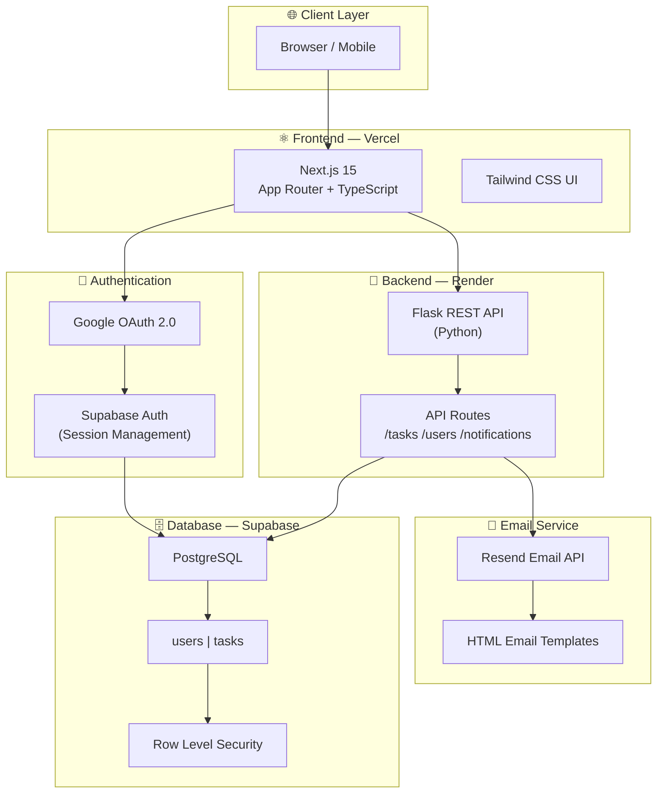
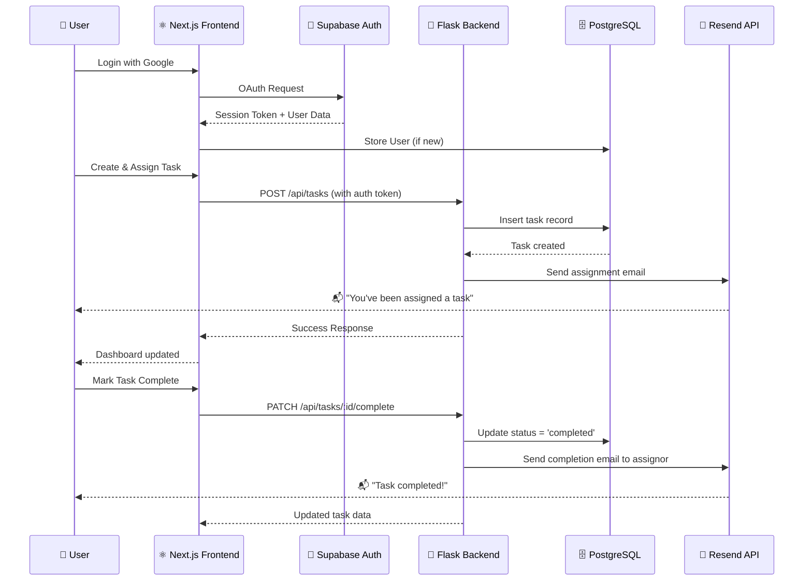
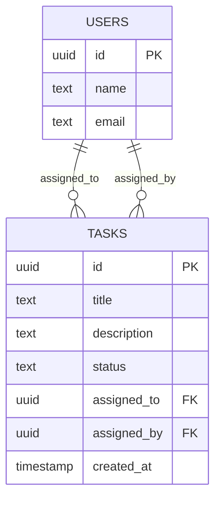

<div align="center">

<!-- Banner -->


<!-- Badges -->
<p align="center">
  
  
  
  
  
</p>

<p align="center">
  
  
  
  
</p>

<p align="center">
  
  
  
  
</p>

<br/>

**HairDrama Task Manager** is a full-stack, production-ready team task management platform where teams can create, assign, track, and complete tasks — with automated email notifications powered by Resend API. Built with a modern Next.js 15 frontend and a decoupled Flask Python backend.

<br/>

[🚀 Live Demo](https://hairdrama-task-manager-coral.vercel.app) · [📖 Documentation](#) · [🐛 Report Bug](../../issues) · [✨ Request Feature](../../issues)

</div>

---

## 📌 Table of Contents

- [Overview](#-overview)
- [Key Features](#-key-features)
- [Architecture](#-architecture)
- [Tech Stack](#-tech-stack)
- [Database Schema](#-database-schema)
- [Folder Structure](#-folder-structure)
- [Getting Started](#-getting-started)
- [Environment Variables](#-environment-variables)
- [Backend Setup](#-backend-setup-flask)
- [Frontend Setup](#-frontend-setup-nextjs)
- [Deployment](#-deployment)
- [Screenshots](#-screenshots)
- [API Endpoints](#-api-endpoints)
- [Future Enhancements](#-future-enhancements)
- [Learning Outcomes](#-learning-outcomes)
- [Contributing](#-contributing)
- [License](#-license)
- [Author](#-author)

---

## 🌟 Overview

HairDrama Task Manager is a **modern, full-stack SaaS-grade team productivity platform** that streamlines task assignment and tracking for collaborative teams. The platform features Google OAuth for frictionless authentication, a real-time dashboard to monitor task progress, and an automated email notification system that keeps every team member in the loop.

The project follows a **decoupled architecture** — a Next.js 15 frontend communicates with a Flask REST API backend, with Supabase serving as both the authentication provider and the PostgreSQL database layer.

> 🎯 Built as a complete internship evaluation project to demonstrate full-stack proficiency across frontend, backend, database design, third-party integrations, and deployment.

---

## ✨ Key Features

| Feature | Description |
|---|---|
| 🔐 **Google OAuth** | One-click sign-in using Google accounts via Supabase Auth |
| 👥 **Team Collaboration** | Assign tasks to any registered team member |
| 📝 **Task Management** | Create, update, and delete tasks with full CRUD support |
| 📊 **Status Tracking** | Track tasks across `pending → in_progress → completed` lifecycle |
| 📧 **Email on Assignment** | Automated email sent to assignee when a task is assigned |
| ✅ **Email on Completion** | Automated email sent to assignor when a task is marked complete |
| 📱 **Responsive Dashboard** | Mobile-first, fully responsive UI with Tailwind CSS |
| 🔒 **Secure by Default** | Supabase Row Level Security (RLS) for data isolation |
| ⚡ **Fast & Modern** | Next.js 15 App Router with Server Components for performance |

---

## 🏗️ Architecture

### System Architecture Diagram



### Request Flow



---

## 🛠️ Tech Stack

### Frontend

| Technology | Version | Purpose |
|---|---|---|
| [Next.js](https://nextjs.org/) | 15 | React framework with App Router |
| [TypeScript](https://www.typescriptlang.org/) | 5.x | Type safety & developer experience |
| [Tailwind CSS](https://tailwindcss.com/) | 3.x | Utility-first styling |
| [Supabase JS](https://supabase.com/docs/reference/javascript) | Latest | Auth client & database queries |

### Backend

| Technology | Version | Purpose |
|---|---|---|
| [Flask](https://flask.palletsprojects.com/) | 3.x | REST API server |
| [Python](https://www.python.org/) | 3.11+ | Backend runtime |
| [Supabase Python](https://github.com/supabase-community/supabase-py) | Latest | Database interaction |
| [Resend](https://resend.com/) | Latest | Transactional email delivery |

### Infrastructure

| Service | Purpose |
|---|---|
| [Supabase](https://supabase.com/) | PostgreSQL database + Authentication |
| [Vercel](https://vercel.com/) | Frontend deployment & CDN |
| [Render](https://render.com/) | Flask backend deployment |

---

## 🗄️ Database Schema

### Entity Relationship Diagram



### Table Definitions

<details>
<summary>📋 <strong>users</strong> table</summary>

```sql
create table users (
  id    uuid primary key default gen_random_uuid(),
  name  text not null,
  email text unique not null
);
```

</details>

<details>
<summary>📋 <strong>tasks</strong> table</summary>

```sql
create type task_status as enum ('pending', 'in_progress', 'completed');

create table tasks (
  id          uuid primary key default gen_random_uuid(),
  title       text not null,
  description text,
  status      task_status default 'pending',
  assigned_to uuid references users(id) on delete set null,
  assigned_by uuid references users(id) on delete set null,
  created_at  timestamp with time zone default now()
);
```

</details>

---

## 📁 Folder Structure

```
hairdrama-task-manager/
│
├── 📂 frontend/                      # Next.js 15 App
│   ├── 📂 app/
│   │   ├── 📂 (auth)/
│   │   │   └── login/page.tsx        # Google OAuth login page
│   │   ├── 📂 dashboard/
│   │   │   ├── page.tsx              # Main dashboard
│   │   │   └── layout.tsx            # Dashboard layout
│   │   ├── layout.tsx                # Root layout
│   │   └── page.tsx                  # Landing / redirect
│   ├── 📂 components/
│   │   ├── TaskCard.tsx              # Individual task card
│   │   ├── TaskForm.tsx              # Create/edit task form
│   │   ├── TaskList.tsx              # Task list container
│   │   ├── UserAvatar.tsx            # User avatar component
│   │   └── Navbar.tsx                # Navigation bar
│   ├── 📂 lib/
│   │   ├── supabase.ts               # Supabase client config
│   │   └── api.ts                    # Flask API helper functions
│   ├── 📂 types/
│   │   └── index.ts                  # TypeScript interfaces
│   ├── .env.local                    # Frontend env variables
│   ├── next.config.ts                # Next.js config
│   ├── tailwind.config.ts            # Tailwind config
│   └── package.json
│
├── 📂 backend/                       # Flask Python API
│   ├── 📂 routes/
│   │   ├── tasks.py                  # Task CRUD routes
│   │   ├── users.py                  # User routes
│   │   └── notifications.py         # Email trigger routes
│   ├── 📂 services/
│   │   ├── email_service.py          # Resend email logic
│   │   └── supabase_client.py        # Supabase DB connection
│   ├── 📂 templates/
│   │   ├── task_assigned.html        # Assignment email template
│   │   └── task_completed.html       # Completion email template
│   ├── app.py                        # Flask app entry point
│   ├── requirements.txt              # Python dependencies
│   └── .env                          # Backend env variables
│
├── README.md
└── .gitignore
```

---

## 🚀 Getting Started

### Prerequisites

Make sure you have the following installed:

- **Node.js** `>= 18.x`
- **Python** `>= 3.11`
- **npm** or **yarn**
- **pip**
- A **Supabase** project ([create one free](https://supabase.com/))
- A **Resend** account ([create one free](https://resend.com/))

---

## 🔐 Environment Variables

### Frontend (`frontend/.env.local`)

```env
# Supabase
NEXT_PUBLIC_SUPABASE_URL=https://your-project.supabase.co
NEXT_PUBLIC_SUPABASE_ANON_KEY=your-supabase-anon-key

# Flask Backend
NEXT_PUBLIC_API_URL=http://localhost:5000
```

### Backend (`backend/.env`)

```env
# Supabase
SUPABASE_URL=https://your-project.supabase.co
SUPABASE_SERVICE_ROLE_KEY=your-service-role-key

# Resend Email API
RESEND_API_KEY=re_your_resend_api_key
FROM_EMAIL=noreply@yourdomain.com

# Flask Config
FLASK_ENV=development
SECRET_KEY=your-secret-key-here
```

> ⚠️ **Never commit `.env` files.** They are included in `.gitignore` by default.

---

## 🐍 Backend Setup (Flask)

```bash
# 1. Navigate to backend directory
cd backend

# 2. Create and activate a virtual environment
python -m venv venv
source venv/bin/activate       # On Windows: venv\Scripts\activate

# 3. Install dependencies
pip install -r requirements.txt

# 4. Add your environment variables
cp .env.example .env
# Fill in your values in .env

# 5. Run the Flask development server
python app.py
# Server starts at http://localhost:5000
```

**`requirements.txt`**

```txt
flask==3.0.0
flask-cors==4.0.0
supabase==2.3.0
resend==0.6.0
python-dotenv==1.0.0
gunicorn==21.2.0
```

---

## ⚛️ Frontend Setup (Next.js)

```bash
# 1. Navigate to frontend directory
cd frontend

# 2. Install dependencies
npm install

# 3. Add your environment variables
cp .env.local.example .env.local
# Fill in your Supabase credentials

# 4. Run the development server
npm run dev
# App starts at http://localhost:3000
```

### Supabase Setup

1. Go to your [Supabase Dashboard](https://supabase.com/dashboard)
2. Create a new project
3. Run the SQL from the [Database Schema](#-database-schema) section in the **SQL Editor**
4. Under **Authentication → Providers**, enable **Google** and add your OAuth credentials
5. Add your site URL to **Authentication → URL Configuration**

---

## 🚢 Deployment

### Frontend → Vercel

```bash
# Install Vercel CLI
npm install -g vercel

# Deploy from frontend directory
cd frontend
vercel

# Set environment variables in Vercel Dashboard:
# NEXT_PUBLIC_SUPABASE_URL
# NEXT_PUBLIC_SUPABASE_ANON_KEY
# NEXT_PUBLIC_API_URL  (your Render backend URL)
```

Or connect your GitHub repo directly via [vercel.com/new](https://vercel.com/new) for automatic CI/CD deployments on every push.

### Backend → Render

1. Push your `backend/` folder to a GitHub repository
2. Go to [render.com](https://render.com/) → **New Web Service**
3. Connect your GitHub repo
4. Configure the service:

| Setting | Value |
|---|---|
| **Runtime** | Python 3 |
| **Build Command** | `pip install -r requirements.txt` |
| **Start Command** | `gunicorn app:app` |
| **Environment** | Add all variables from `backend/.env` |

5. Deploy! Render will auto-deploy on every push to `main`.

---
## 🌐 Live Deployment

Frontend:
https://hairdrama-task-manager-coral.vercel.app

Backend:
https://hairdrama-task-manager-vkcs.onrender.com

---
## 📸 Screenshots

<details>
<summary>🔐 Login Page</summary>

> 📌 _Screenshot placeholder — replace with actual screenshot_
> 
> 

</details>

<details>
<summary>📊 Dashboard</summary>

> 📌 _Screenshot placeholder — replace with actual screenshot_
>
> 

</details>

<details>
<summary>📝 Create Task Modal</summary>

> 📌 _Screenshot placeholder — replace with actual screenshot_
>
> 

</details>

<details>
<summary>📧 Email Notification</summary>

> 📌 _Screenshot placeholder — replace with actual screenshot_
>
> 

</details>

---

## 📡 API Endpoints

Base URL: `https://hairdrama-api.onrender.com` (production) | `http://localhost:5000` (local)

### Users

| Method | Endpoint | Description | Auth |
|---|---|---|---|
| `POST` | `/api/users` | Register or sync a user | ✅ Required |
| `GET` | `/api/users` | Get all team members | ✅ Required |
| `GET` | `/api/users/:id` | Get user by ID | ✅ Required |

### Tasks

| Method | Endpoint | Description | Auth |
|---|---|---|---|
| `GET` | `/api/tasks` | Get all tasks for current user | ✅ Required |
| `POST` | `/api/tasks` | Create a new task | ✅ Required |
| `GET` | `/api/tasks/:id` | Get a specific task | ✅ Required |
| `PATCH` | `/api/tasks/:id` | Update task details | ✅ Required |
| `PATCH` | `/api/tasks/:id/complete` | Mark task as completed | ✅ Required |
| `DELETE` | `/api/tasks/:id` | Delete a task | ✅ Required |

### Example Request & Response

<details>
<summary><code>POST /api/tasks</code> — Create Task</summary>

**Request Body:**
```json
{
  "title": "Design new landing page",
  "description": "Create a modern landing page using Figma",
  "assigned_to": "uuid-of-team-member",
  "assigned_by": "uuid-of-current-user"
}
```

**Response `201`:**
```json
{
  "id": "task-uuid",
  "title": "Design new landing page",
  "description": "Create a modern landing page using Figma",
  "status": "pending",
  "assigned_to": "uuid-of-team-member",
  "assigned_by": "uuid-of-current-user",
  "created_at": "2024-01-15T10:30:00Z"
}
```

</details>

---

## 🔮 Future Enhancements

- [ ] 🔔 **Real-time notifications** using Supabase Realtime (WebSockets)
- [ ] 📅 **Task due dates** with overdue status highlighting
- [ ] 🏷️ **Task labels & priority** (Low / Medium / High / Critical)
- [ ] 📊 **Analytics dashboard** — team productivity metrics & charts
- [ ] 💬 **Task comments** — threaded discussions on individual tasks
- [ ] 📎 **File attachments** — attach files to tasks via Supabase Storage
- [ ] 🌙 **Dark mode** — system-aware theme switching
- [ ] 📱 **Progressive Web App (PWA)** — offline support & home screen install
- [ ] 🔗 **Slack / Discord integration** — task notifications in team channels
- [ ] 🤖 **AI task suggestions** — smart assignment recommendations using Gemini API

---

## 🎓 Learning Outcomes

Building HairDrama Task Manager provided hands-on experience across the full stack:

- **Frontend Architecture** — Implementing Next.js 15 App Router with Server and Client Components, TypeScript interfaces, and Tailwind CSS component design
- **Authentication Flows** — Integrating Google OAuth with Supabase Auth, managing sessions, and protecting routes using middleware
- **Backend API Design** — Designing RESTful APIs with Flask, structuring routes, and handling CORS for cross-origin requests
- **Database Design** — Designing normalized PostgreSQL schemas, writing Supabase queries, and implementing Row Level Security (RLS) policies
- **Third-party Integrations** — Consuming the Resend Email API with custom HTML templates for transactional emails
- **Environment Management** — Separating frontend and backend configuration using `.env` files with proper secrets handling
- **Deployment & DevOps** — Deploying a decoupled architecture to Vercel (frontend) and Render (backend) with CI/CD pipelines
- **API Integration** — Connecting a Next.js frontend to a separate Flask backend with proper authentication header forwarding

---

## 🤝 Contributing

Contributions are always welcome! Here's how to get started:

```bash
# 1. Fork the repository
# Click the Fork button at the top of this page

# 2. Clone your fork
git clone https://github.com/your-username/hairdrama-task-manager.git

# 3. Create a feature branch
git checkout -b feature/your-feature-name

# 4. Make your changes and commit
git add .
git commit -m "feat: add your feature description"

# 5. Push to your branch
git push origin feature/your-feature-name

# 6. Open a Pull Request
# Go to GitHub and click "Compare & pull request"
```

### Commit Convention

This project uses [Conventional Commits](https://www.conventionalcommits.org/):

| Prefix | Usage |
|---|---|
| `feat:` | New feature |
| `fix:` | Bug fix |
| `docs:` | Documentation changes |
| `style:` | Formatting, no logic change |
| `refactor:` | Code restructure |
| `chore:` | Dependency updates, tooling |

---
## 📈 Project Highlights

✅ Google OAuth Authentication

✅ Task Creation & Assignment

✅ Team Collaboration Dashboard

✅ Email Notifications using Resend

✅ Flask REST API Backend

✅ Supabase PostgreSQL Database

✅ Next.js 15 + TypeScript Frontend

✅ Production Deployment (Vercel + Render)

---
## 📄 License

This project is licensed under the **MIT License** — see the [LICENSE](LICENSE) file for details.

```
MIT License — free to use, modify, and distribute with attribution.
```

---

## 👨‍💻 Author

<div align="center">


### Kartik
**B.Tech CSE | AIMT Lucknow (AKTU) | 2023–2027**

*Full-Stack Developer · AI Enthusiast · Open to Internship Opportunities*


[](https://github.com/kartikshukla2301-eng)
[](mailto:kartikshukla2301@gmail.com)
[](https://github.com/kartikshukla2301-eng/Hairdrama-Task-Manager)
[](https://hairdrama-task-manager-coral.vercel.app)
[](https://hairdrama-task-manager-vkcs.onrender.com)
[](https://www.linkedin.com/in/kartik-shukla-cse)
</div>
Project Repository:


---

<div align="center">

**⭐ If this project helped you or you found it interesting, please give it a star!**


</div>
